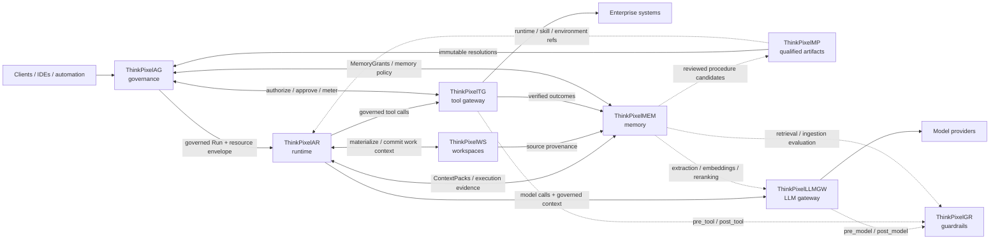

# ThinkPixelLLMGW

ThinkPixelLLMGW is an OpenAI-compatible LLM gateway written in Go. It centralizes API-key authentication, model routing, provider credentials, per-key rate limits and budgets, usage accounting, audit logging, and administration.

> Project status (reviewed August 26, 2026): Chat Completions release candidate. OpenAI, Vertex AI, and AWS Bedrock chat-completions paths and the core admin API are implemented and locally qualified. Staging resilience evidence remains incomplete, so the project is not yet production-ready. See the [release checklist](docs/release-qualification.md), [RC evidence](docs/release-evidence-2026-08-26.md), and [architecture decisions](docs/adr/README.md).

Release qualification is deployment-specific. Use the [release checklist](docs/release-qualification.md) and [operations runbook](docs/operations-runbook.md); a passing local suite does not replace live-provider canaries, dependency-failure exercises, restore evidence, or staging capacity tests.

## Implemented

- `POST /v1/chat/completions`, including SSE-framed OpenAI streaming with terminal token and cost accounting
- PostgreSQL repositories for keys, providers, models, aliases, admins, usage, and monthly summaries
- Redis-backed atomic sliding-window rate limiting and budget tracking
- Exact nano-USD billing arithmetic with rolling Redis migration support
- Database-driven pricing and asynchronous billing/usage queues
- Admin authentication with Argon2id credentials and HS256 JWTs
- Admin CRUD for API keys, providers, models, and model aliases
- AES-256-GCM provider-credential encryption
- Runtime-only environment credential overrides that never mutate provider rows
- Prometheus metrics at `GET /metrics`
- Privacy-controlled file logging plus an optional encrypted Redis-to-S3/MinIO sink
- React 19 admin UI with a FastAPI backend-for-frontend (BFF), including API-key management, model catalog, read-only billing/usage administration, and bounded dashboard statistics

OpenAI, Google Vertex AI, and AWS Bedrock perform non-streaming and streaming chat-completion requests. Vertex AI uses its OpenAI-compatible endpoint with Google OAuth refresh; Bedrock uses the native model-independent Converse API with the AWS SDK credential chain and SigV4 signing. See [provider configuration](docs/providers.md) for credentials, capabilities, and provider-specific limits.

The OpenAI Responses API is under active development. `POST /v1/responses` is registered for non-streaming requests routed to native OpenAI providers, with tenant-safe gateway response IDs and provider-managed continuation state. Streaming, background execution, translated providers, resource retrieval/deletion, and hosted tools remain gated. See [Responses API compatibility](docs/responses-api.md).

## Architecture

```text
LLM client ── API key ──> Go gateway ──> OpenAI / Vertex AI / AWS Bedrock
                              │
                              ├── PostgreSQL (configuration and durable usage)
                              ├── Redis (rate limits, budgets, queues, log buffer)
                              ├── S3/MinIO (optional audit-log archive)
                              └── /metrics (Prometheus)

Browser ── signed HttpOnly cookie ──> FastAPI BFF ── JWT ──> Go admin API
```

## Quick start with Docker Compose

Prerequisites: Docker with Compose and an OpenAI API key.

```bash
cp .env.example .env
```

Edit `.env` and set at least:

```dotenv
JWT_SECRET=replace-with-a-long-random-value
ENCRYPTION_KEY=replace-with-64-hex-characters
METRICS_AUTH_TOKEN=replace-with-at-least-32-random-characters
OPENAI_API_KEY=sk-...
```

Generate an encryption key with:

```bash
./llm_gateway/scripts/generate-encryption-key.sh
```

Start the stack and bootstrap an administrator:

```bash
docker compose up -d --build
docker compose run --rm \
  -e ADMIN_BOOTSTRAP_EMAIL=admin@example.com \
  -e ADMIN_BOOTSTRAP_PASSWORD='replace-with-a-strong-password' \
  --entrypoint /app/init-admin \
  gateway
```

The gateway listens on `http://localhost:8080`. See [docs/quickstart.md](docs/quickstart.md) and [docs/bootstrap-admin.md](docs/bootstrap-admin.md) for the full workflow.

## Local development

The gateway requires PostgreSQL, Redis, `DATABASE_URL`, `JWT_SECRET` (at least 32 characters), `ENCRYPTION_KEY` (exactly 64 hexadecimal characters), and `METRICS_AUTH_TOKEN` (at least 32 characters) at startup. When S3 logging is enabled, its bucket, region, and positive buffer/flush settings are also validated before startup.

```bash
docker compose up -d postgres redis minio minio-create-bucket
cd llm_gateway
go run ./cmd/gateway
```

Useful checks:

```bash
cd llm_gateway
GOCACHE=/tmp/thinkpixel-go-cache go test ./...

cd ../webui/frontend
pnpm install
pnpm run build

cd ../bff
python3 -m compileall -q app
```

`go test -short ./...` is the hermetic Go unit suite. PostgreSQL, Redis-server, and MinIO tests are explicitly tagged and run with `make test-integration-all`; see the [testing guide](docs/testing-guide.md).

For OpenAI streaming requests, the gateway requests terminal usage, parses complete SSE events independently of network read boundaries, and records input, output, cached, and reasoning tokens. If a stream is interrupted or completes without provider usage, its accounting status is recorded as unknown and no zero-cost success is silently claimed; operators should alert and reconcile those requests from provider billing data.

Currency is accumulated and persisted as signed integer nano-USD (`10^-9 USD`). Existing dollar-valued JSON fields remain numeric compatibility boundaries and are rounded half away from zero to nano-USD before billing. Apply migration `20260712000004_exact_currency` before deploying this version; rolling instances dual-read and rewrite legacy Redis decimal-dollar totals.

The HTTP server keeps header reads, request reads, ordinary response writes, and idle connections bounded. Streaming handlers clear only their response write deadline; provider calls remain bounded by `PROVIDER_REQUEST_TIMEOUT`. During shutdown, streams may drain until `HTTP_SHUTDOWN_TIMEOUT`, after which active connections are closed. The gateway then uses a fresh shutdown deadline to stop queue workers, flush billing and logs, and close queues, providers, Redis, and PostgreSQL. Startup is transactional: a router-construction failure rolls back resources already created.

Runnable Go examples are isolated as independent commands:

```bash
cd llm_gateway
go run ./examples/encryption
go run ./examples/s3-logging
```

The S3 example requires the environment and services described in [llm_gateway/examples/README.md](llm_gateway/examples/README.md).

## API surface

| Endpoint | Authentication | Purpose |
|---|---|---|
| `GET /health` | none | Process liveness |
| `GET /ready` | none | PostgreSQL, Redis, provider registry, and worker readiness |
| `GET /metrics` | metrics bearer token | Prometheus metrics |
| `POST /v1/chat/completions` | gateway API key | Chat proxy |
| `POST /admin/auth/login` | none | Email/password login |
| `POST /admin/auth/token` | none | Service-token login |
| `GET /admin/me` | admin JWT | Current administrator/service identity |
| `/admin/keys[/{id}]` | admin JWT | API-key CRUD and regeneration |
| `/admin/providers[/{id}]` | admin JWT | Provider CRUD |
| `/admin/models[/{id}]` | admin JWT | Model CRUD |
| `/admin/aliases[/{id}]` | admin JWT | Alias CRUD |
| `GET /admin/usage` | admin JWT | Bounded, paginated request usage (maximum 90-day range) |
| `GET /admin/billing/monthly` | admin JWT | Paginated monthly nano-USD billing summaries |
| `GET /admin/dashboard` | admin JWT | Bounded gateway, usage, error, latency, and cost summary |

Read operations require the `viewer` role; mutations require `admin`. There is no `editor` role in the current implementation.

## Documentation

- [Documentation index](docs/README.md)
- [Quick start](docs/quickstart.md)
- [Environment variables](docs/env-variables.md)
- [Provider configuration](docs/providers.md)
- [Responses API compatibility](docs/responses-api.md)
- [Platform alignment and ownership](ALIGNMENT.md)
- [Guardrails integration contract](docs/contracts/guardrails.md)
- [Database schema](docs/database-schema.md)
- [Metrics](docs/metrics.md)
- [Testing guide](docs/testing-guide.md)
- [Release qualification](docs/release-qualification.md)
- [Operations runbook](docs/operations-runbook.md)
- [Web UI](webui/README.md)
- [Architecture decisions](docs/adr/README.md)
- [Release-candidate evidence](docs/release-evidence-2026-08-26.md)

## Continuous integration

GitHub Actions validates Go formatting/vet, race-enabled unit tests, Docker-backed integration tests, migration down/up round trips, frontend lint/build, BFF compilation/tests, and the production container build. Pull-request checks require no provider secrets.

Run the hermetic local repository gate from the root with `make verify`. Dependency-backed integration and migration gates remain available through the targets in `llm_gateway/Makefile`.

## ThinkPixel platform

This project is part of the **ThinkPixel** family: a modular, vendor-neutral set of components for building governed enterprise AI-agent platforms.

Each component is independently useful. The complete platform is a composition of replaceable services connected through versioned contracts; no component requires the full stack in order to be deployed.

| Component | Role |
|---|---|
| [ThinkPixelAG](https://github.com/bdobrica/ThinkPixelAG) | Agent governance and lifecycle control plane: agent/run authority, policy decisions, resource envelopes, approvals, revocation, and trusted governance state. |
| [ThinkPixelAR](https://github.com/bdobrica/ThinkPixelAR) | Agent runtime: durable Sessions, isolated/disposable execution, harness adaptation, recovery, and runtime events. |
| [ThinkPixelWS](https://github.com/bdobrica/ThinkPixelWS) | Durable roaming Workspaces: persistent work context, immutable generations, materializations, snapshots, forks, and source provenance. |
| [ThinkPixelMEM](https://github.com/bdobrica/ThinkPixelMEM) | Long-term agent memory: governed learned context, provenance, temporal revisions, retrieval, correction, and forgetting. |
| [ThinkPixelMP](https://github.com/bdobrica/ThinkPixelMP) | Marketplace and software supply-chain plane for Skills, runtimes, MCP servers, agent bundles, and other immutable agentic artifacts. |
| [ThinkPixelTG](https://github.com/bdobrica/ThinkPixelTG) | Tool gateway and policy-enforcement point for governed tool calls, downstream credentials, side effects, idempotency, and tool evidence. |
| [ThinkPixelLLMGW](https://github.com/bdobrica/ThinkPixelLLMGW) | LLM gateway for provider abstraction, model routing, credentials, budgets, accounting, and model-access policy enforcement. |
| [ThinkPixelGR](https://github.com/bdobrica/ThinkPixelGR) | Guardrails evaluator for model, tool, retrieval, and ingestion content. It returns findings/decisions; the calling gateway or service enforces them. |

### Intended composition



The diagram describes the **target integration model**, not a claim that every edge is implemented in every current release.

### Integration rules

The platform follows a few cross-component rules:

- **Authority does not emerge from content.** Marketplace metadata, Skills, Workspace membership, retrieved memory, model output, or a guardrail `allow` decision cannot grant permissions that the governed Run does not already have.
- **State has one authoritative owner.** Components exchange references and versioned messages; they do not read or write another component's database directly.
- **Integrations are adapters, not domain dependencies.** A ThinkPixel integration should be configurable and replaceable with a contract-compatible alternative.
- **Cross-component identity is explicit.** Where relevant, requests should carry stable governed context such as tenant, principal, agent, Run, Session/Workspace references, immutable artifact digests, and trace context.
- **Public integration contracts are versioned.** OpenAPI/JSON Schema/protobuf or another explicit wire contract is preferred over importing another repository's internal types.
- **Vendor-specific behavior stays behind adapters.** Model providers, agent harnesses, storage systems, registries, policy engines, and execution substrates must not become platform-wide domain contracts.

### Planned integration points

| Integration | Intended contract |
|---|---|
| **AG → AR** | AG admits a Run and supplies its authority/resource context; AR executes it and must not enlarge that authority. Revocation, lease, and fencing state flow back into runtime enforcement. |
| **MP → AG / AR / WS** | MP resolves qualified artifacts to immutable identities/digests. AG decides whether they may be used; AR/WS consume the resolved runtime, Skill, or environment references. Qualification is not authorization. |
| **AR ↔ WS** | AR materializes a durable Workspace generation into disposable execution and returns committed/checkpointed work to WS. Session identity remains owned by AR; Workspace identity remains owned by WS. |
| **AR → LLMGW** | Agent model calls go through LLMGW with governed Run/tenant context. Provider credentials and provider-specific routing stay outside the harness. |
| **LLMGW ↔ GR** | LLMGW will support an optional configured GR endpoint/profile mapping. It invokes `pre_model` before provider dispatch and `post_model` before releasing model output, then enforces GR's decision/transformation. GR remains optional and replaceable; its wire API is the contract. |
| **AR → TG** | Harness tool calls cross TG rather than reaching governed enterprise systems directly. TG owns credential brokerage, idempotency/side-effect handling, and trusted tool evidence. |
| **TG ↔ AG** | TG asks AG (or a contract-compatible authorizer) whether the current governed Run may perform the exact operation and obtains action-scoped approval when required. TG returns trusted metering/evidence. |
| **TG ↔ GR** | TG invokes `pre_tool` and `post_tool` evaluation when configured and enforces the result. A GR allow never overrides an AG authorization denial. |
| **AR / WS / TG → MEM** | Execution history, Workspace provenance, and verified tool outcomes may become evidence for learned memory. MEM does not become the source of truth for those upstream systems. |
| **AG ↔ MEM** | AG supplies Run-scoped memory authority (for example MemoryGrants); MEM enforces it for reads/writes and returns structured ContextPacks. |
| **MEM ↔ LLMGW / GR** | MEM may use LLMGW for extraction/embedding/reranking and GR for ingestion/retrieval inspection while keeping canonical memory state independent from either service. |
| **MEM → MP** | Learned procedure candidates may be reviewed and promoted through MP into qualified reusable Skills; learning does not silently become trusted executable behavior. |

Project-specific implementation status, supported versions, and release qualification belong in each project's own documentation.

## License

Licensed under the terms in [LICENSE](LICENSE).
