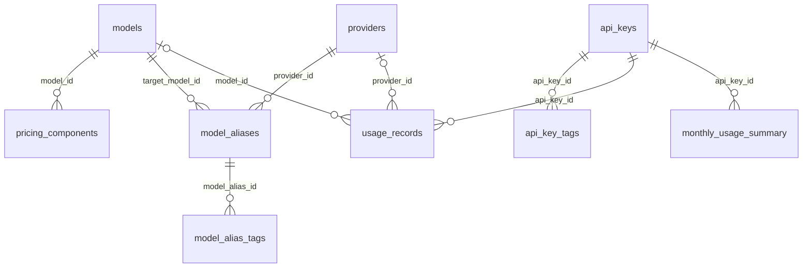

# Database schema

This document describes the schema produced by the committed PostgreSQL migrations in `llm_gateway/migrations`. The latest migration is `20260712000005_admin_usage_indexes`.

## Relationships



`models.provider_id` is a provider catalog identifier stored as `VARCHAR`, not a foreign key to `providers.id`. Runtime routing matches it to an enabled provider type. `model_aliases.provider_id` and `usage_records.provider_id` are UUID foreign keys to `providers`.

## Tables

### `providers`

Stores runtime provider instances.

| Column | Type | Notes |
|---|---|---|
| `id` | UUID | Primary key |
| `name` | VARCHAR(100) | Unique runtime name; environment overrides expect `openai` or `vertexai` |
| `display_name` | VARCHAR(255) | UI label |
| `provider_type` | VARCHAR(50) | Implemented: `openai`, `vertexai`, `bedrock` |
| `encrypted_credentials` | JSONB | Per-field AES-GCM ciphertext; nullable |
| `config` | JSONB | Non-secret provider configuration |
| `enabled` | BOOLEAN | Soft enable/disable flag |
| `created_at`, `updated_at` | TIMESTAMPTZ | `updated_at` maintained by trigger |

Credential/config keys are documented in [Provider configuration](providers.md). Never write plaintext directly into `encrypted_credentials`; use `/admin/providers`.

### `models`

Stores the model catalog. `model_name` is globally unique. Fields fall into these groups:

- Identity: `id`, `model_name`, `provider_id`, `source`, `version`, deprecation fields.
- Regions and resolutions: `supported_regions`, `supported_resolutions`.
- Capabilities: explicit booleans for text, image, audio, video, PDF, tools, reasoning, caching, streaming, batching, JSON, reranking, embeddings, web search, and related features.
- Limits: request/token throughput, context/input/output limits, document chunks, vector size, media counts/durations, batch and concurrency limits.
- Commercial/operational metadata: `currency`, pricing/metadata schema versions, latency, availability, SLA fields, and free-form `metadata` JSONB.
- Timestamps: `created_at`, `updated_at`.

Pricing is normalized into `pricing_components`; there are no `input_cost_per_token`, `output_cost_per_token`, `mode`, or `litellm_provider` columns.

### `pricing_components`

Each row defines one price for a model:

| Column | Type | Notes |
|---|---|---|
| `model_id` | UUID | References `models`, cascades on delete |
| `code` | VARCHAR(100) | Component identifier, unique with `model_id` |
| `direction` | VARCHAR(50) | For example `input` or `output` |
| `modality` | VARCHAR(50) | For example `text` |
| `unit` | VARCHAR(50) | For example `token` |
| `tier`, `scope` | VARCHAR(50) | Optional qualifiers |
| `price` | NUMERIC(30,12) | USD price per unit |
| `metadata_schema_version`, `metadata` | mixed | Optional extension metadata |

Cost lookup uses each component's `direction`, `modality`, and optional tier. The `code` remains the unique catalog identifier for that model.

### `model_aliases` and `model_alias_tags`

`model_aliases` maps a unique client-facing `alias` to `target_model_id`. It can optionally pin a UUID `provider_id`, add `custom_config`, and be disabled. `model_alias_tags` stores unique key/value metadata per alias. Both child relationships cascade on parent deletion; provider deletion sets an alias provider override to null.

### `admin_users` and `admin_tokens`

`admin_users` stores unique email addresses, Argon2id password hashes, role arrays, enabled state, last login, and timestamps. `admin_tokens` stores unique service names and Argon2id token hashes with roles, enabled state, optional expiration, last use, and timestamps.

The implemented roles are `admin` for mutations and `viewer` for reads. The tables support service identities, but CRUD endpoints for administrator users and service tokens are not currently implemented.

### `api_keys` and `api_key_tags`

| Column | Type | Notes |
|---|---|---|
| `id` | UUID | Primary key |
| `name` | VARCHAR(255) | Display name |
| `key_hash` | VARCHAR(64) | Unique SHA-256 hex digest; plaintext is never stored |
| `allowed_models` | TEXT[] | Null/empty policy is handled by the API-key model |
| `rate_limit_per_minute` | INTEGER | Defaults to 60 |
| `monthly_budget_nano_usd` | BIGINT | Nullable exact budget; `1 USD = 1,000,000,000` nano-USD |
| `enabled` | BOOLEAN | Revocation/enable state |
| `expires_at` | TIMESTAMPTZ | Optional expiration |
| `created_at`, `updated_at` | TIMESTAMPTZ | `updated_at` maintained by trigger |

`api_key_tags` holds one value per `(api_key_id, key)` and cascades when the API key is deleted.

The Admin API accepts and returns dollar values at its JSON boundary for compatibility, but storage and billing arithmetic use integer nano-USD.

### `usage_records`

One durable row is written asynchronously for each accounted proxy request:

| Column group | Fields |
|---|---|
| Identity | `id`, `request_id`, `api_key_id`, nullable `model_id`, nullable `provider_id` |
| Request | `model_name`, `endpoint` |
| Usage | `input_tokens`, `output_tokens`, `cached_tokens`, `reasoning_tokens` |
| Outcome | `response_time_ms`, `status_code`, nullable `error_message` |
| Time | `created_at` |

There is no per-row cost column in the current table. Durable monthly cost is stored in `monthly_usage_summary`; pricing components and provider evidence are needed for detailed reconciliation.

### `monthly_usage_summary`

Stores one aggregate row per API key, UTC year, and month:

- Total requests and input/output/cached/reasoning tokens.
- Exact `total_cost_nano_usd` as `BIGINT`.
- Created/updated timestamps.

The unique constraint on `(api_key_id, year, month)` supports idempotent upserts. Billing and usage workers update different aggregate fields asynchronously, so operators should include queue state when reconciling a very recent interval.

## Indexes

The committed schema includes:

- Enabled/type indexes for providers.
- Provider, name, active/deprecation, and JSONB metadata indexes for models.
- Model, direction, and modality indexes for pricing components.
- Target/provider/enabled indexes for aliases.
- Email/service-name/hash/enabled/expiry indexes for administrator identities.
- Hash/enabled/expiry indexes for API keys and lookup indexes for both tag tables.
- API-key/time, model/time, creation time, request ID, status/time, and model-name/time indexes for usage records.
- API-key/year/month index for monthly summaries.

Do not assume indexes shown in design discussions exist. In particular, there is no trigram model-name index, usage metadata index, or full-text search index in the committed migrations.

## Valid query examples

### Models and pricing

```sql
SELECT
    m.model_name,
    m.provider_id,
    pc.code,
    pc.price,
    pc.unit
FROM models m
JOIN pricing_components pc ON pc.model_id = m.id
WHERE m.is_deprecated = false
ORDER BY m.model_name, pc.code;
```

### Monthly budget utilization

```sql
SELECT
    ak.name,
    mus.year,
    mus.month,
    mus.total_requests,
    mus.total_cost_nano_usd,
    ak.monthly_budget_nano_usd,
    ROUND(
      100.0 * mus.total_cost_nano_usd /
      NULLIF(ak.monthly_budget_nano_usd, 0),
      2
    ) AS budget_used_percent
FROM monthly_usage_summary mus
JOIN api_keys ak ON ak.id = mus.api_key_id
ORDER BY mus.year DESC, mus.month DESC, mus.total_cost_nano_usd DESC;
```

### Recent errors

```sql
SELECT created_at, request_id, model_name, status_code, error_message
FROM usage_records
WHERE status_code >= 400
  AND created_at >= NOW() - INTERVAL '24 hours'
ORDER BY created_at DESC
LIMIT 100;
```

### Tags

```sql
SELECT ak.name, akt.key, akt.value
FROM api_keys ak
JOIN api_key_tags akt ON akt.api_key_id = ak.id
WHERE akt.key = 'environment' AND akt.value = 'production';
```

## Request data flow

1. Hash the client bearer key and resolve `api_keys`, including allowed models and expiry.
2. Enforce the Redis rate limit and read budget state.
3. Resolve a model or alias and its runtime provider.
4. Proxy the request and collect provider-reported token usage.
5. Enqueue usage persistence and exact billing updates.
6. Workers write `usage_records` and upsert `monthly_usage_summary`; failures enter Redis dead-letter queues.

Interrupted streams or streams without terminal usage are recorded with unknown accounting semantics and require provider reconciliation; they are not silently treated as zero-cost successes.

## Migrations

Migrations are paired `.up.sql` and `.down.sql` files:

1. `20251125000001_initial_schema`
2. `20251125000002_seed_data`
3. `20260429000003_add_monthly_usage_summary`
4. `20260712000004_exact_currency`
5. `20260712000005_admin_usage_indexes`

Compose mounts the up migrations into PostgreSQL initialization and therefore applies them only to a new volume. Production operators should execute up files in timestamp order with `psql -v ON_ERROR_STOP=1` under a migration identity and record the applied revision. The repository does not maintain a runtime schema-version table.

Validate a complete down/up round trip on a disposable database with:

```bash
cd llm_gateway
make test-migrations
```

The exact-currency down migration is structurally reversible but converts already-rounded nano-USD values back to floating-point dollars. Review every down migration for data-loss implications before rollback.

## Backup, retention, and scaling

Migration `20260824000006_responses_state` adds `responses`, `response_items`, and `response_tool_executions`. Ownership indexes begin with `api_key_id`; predecessor, active-status, and expiry indexes support bounded continuation, recovery, and cleanup. Deleting an API key or response cascades to its items/tool executions. Response deletion is initially soft so API retrieval immediately returns not found; TTL cleanup performs physical deletion. Backups containing these tables may contain prompts, outputs, tool data, metadata, and encrypted reasoning payloads and must follow the same access, encryption, regional, expiry, and deletion policy as production state.

Use the tested backup/restore procedure in the [Operations runbook](operations-runbook.md). `usage_records` is not partitioned and no archive table is created by migrations. If volume requires partitioning or retention deletion, introduce it through reviewed migrations and update repositories, backups, and reconciliation procedures rather than running the illustrative DDL from old design documents.
